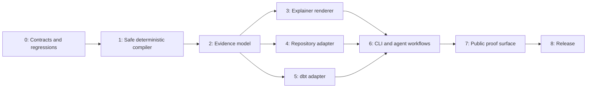

# PageScript v1.1 Completion Plan

## Objective

Ship PageScript v1.1 / Draft 0.7 as a trustworthy source-cited architecture and data-lineage explainer, while preserving its useful `.page` compiler path and tour compatibility.

The plan is deliberately completion-oriented. A single focused engineer should expect roughly 10–14 weeks; repository-language support and browser regression infrastructure are the largest unknowns. The milestones are independently releasable, but public v1.1 should not ship before Milestone 8.

## Milestone 0 — Freeze the contract and establish failing regressions

Create the new public schemas and fixtures before changing implementation behavior.

- Add invalid `.page` fixtures for style-tag termination, unsafe URL schemes, unsafe generic attributes/tags, invalid imports, imported parse failures, imported semantic errors, recursion, and invalid value types.
- Add a determinism harness that starts fresh CLI processes and compares AST, diagnostics, IR, and HTML hashes.
- Add a no-panic corpus for parser, validator, recipe expansion, resolver, evidence parsing, and rendering.
- Add fixture directories for a small Rust repository, TypeScript/JavaScript repository, Python repository, and minimal dbt project.
- Define `evidence-bundle.schema.json` and `explainer-spec.schema.json`, including canonical fixture examples.
- Update `SPEC.md` with the Draft 0.7 scope and draft the migration guide.

Exit gate: every newly captured defect fails on the current implementation; schemas validate example fixtures; the product boundary in `docs/v1-explainer-design.md` is reviewed.

## Milestone 1 — Make the existing compiler safe and deterministic

Refactor the page compiler before introducing new input paths.

- Add a typed validated-document boundary and make all public compile/render helpers validate internally or require a validated value.
- Consolidate primitive definitions and attribute rules into one typed component-spec module. Validators and IR lowering use this module rather than independently checking strings.
- Replace unstable maps with deterministic maps and sort diagnostics, imports, recipe resolution, and render output at every observable boundary.
- Harden `Resolver`: canonical root, importer-relative resolution, no working-directory fallback, symlink escape protection, recursive import diagnostics, and import-cycle limits.
- Detect recipe cycles and enforce expansion depth and node budgets.
- Enforce URI, CSS, element-tag, and attribute policies from the design document.
- Split fixed CSS and runtime JavaScript out of minified Rust string literals into reviewable embedded assets; preserve a standalone output with no external assets.
- Repair renderer/CSS class drift and either implement or reject currently inert primitives.

Likely files: `src/lib.rs`, `src/validator.rs`, `src/resolver.rs`, `src/ir.rs`, `src/render.rs`, new `src/component_spec.rs`, new embedded asset files, schemas, conformance fixtures, and tests.

Exit gate:

- all safety probes fail with stable diagnostics rather than rendering or panicking;
- fifty clean-process hashes match for AST, diagnostics, IR, and HTML fixtures;
- renderer DOM contract tests pass; and
- existing supported examples retain expected behavior or have documented migrations.

## Milestone 2 — Add evidence and explainer domain models

Build the typed product core without attaching it to the CLI yet.

- Implement `EvidenceBundle`, `ExplainerSpec`, `ExplainerIr`, provenance, citation locators, confidence levels, views, and layout inputs as Rust types backed by public JSON schemas.
- Implement strict bundle/spec validators, canonical JSON serialization, SHA-256 digests, path normalization, citation range checks, bundle/spec digest binding, and deterministic diagnostics.
- Implement an evidence workspace resolver separate from `.page` imports, with an explicit root and no process-working-directory fallback.
- Implement deterministic overlay merge rules and `--check` source-digest verification.
- Create a projector from a validated bundle/spec into `ExplainerIr`; do not represent citations as arbitrary component attributes.
- Add schema, serialization, invalid-input, digest-mismatch, and merge-conflict tests.

Likely files: new `src/evidence/` module tree, new schemas, typed fixtures, and public API exports in `src/lib.rs`.

Exit gate: fixed bundle and spec fixtures produce byte-identical validated values and IR; every entity/relationship provenance rule is tested; invalid paths and stale digests cannot reach rendering.

## Milestone 3 — Build the explainer renderer and interaction model

Turn `ExplainerIr` into the flagship standalone page.

- Implement stable graph layout: strongly connected components first, topological layers for DAGs, deterministic ID-based ties, and fixed grouping behavior.
- Render overview, architecture, and lineage views with node/edge status, confidence distinction, relationship labels, and evidence-aware detail panels.
- Add accessible search, filters, focus handling, node selection, keyboard navigation, and a source-citation drawer.
- Ensure every rendered citation is either a safe pinned `https` link or a local `path:line` reference; do not emit untrusted URLs.
- Include no-JavaScript fallback content and prevent external network requests.
- Add browser DOM, accessibility, keyboard, visual snapshot, and offline-network tests.

Likely files: new `src/explainer/` module tree plus shared renderer assets and browser test harness.

Exit gate: a checked-in evidence fixture renders an interactive, keyboard-usable, offline HTML file with correct citations and deterministic coordinates.

## Milestone 4 — Implement the structural repository adapter

Ship the repository workflow with honest claims.

- Add a bounded, ignore-aware local file walker with explicit size, file-count, and language limits.
- Add maintained syntax-parser implementations for Rust, TypeScript/JavaScript, and Python. Extract only modules, declared/exported symbols where reliable, manifest relationships, and static import/module edges.
- Emit exact source locations and digests for every extracted claim.
- Emit structured diagnostics for unsupported syntax, dynamic imports, generated files, caps, and ambiguous relationships rather than guessing.
- Add reproducible sample repositories for each supported language and source-to-bundle golden tests.

Exit gate: `pagescript evidence repo <fixture>` produces a deterministic, source-cited bundle for all three language fixtures; unsupported constructs are visible in diagnostics and never appear as extracted facts.

## Milestone 5 — Implement the dbt adapter

Add the data-lineage vertical as the second first-class source.

- Add versioned readers for supported dbt `manifest.json` and optional `catalog.json` formats.
- Map dbt resources and dependency edges into evidence entities and relationships; cite JSON pointers and local project files where available.
- Normalize resource names, missing metadata, disabled nodes, and cycles deterministically.
- Add fixtures covering models, sources, seeds, snapshots, tests, exposures, column metadata, and an unsupported manifest version.

Exit gate: the minimal dbt fixture produces a deterministic lineage bundle and an explainer whose citations identify both dbt artifact records and local model sources.

## Milestone 6 — Integrate the CLI and agent workflows

Replace the ad-hoc command parser with a typed command structure only if doing so reduces ambiguity; otherwise preserve the existing parser with comprehensive command tests.

- Add `pagescript evidence repo`, `pagescript evidence dbt`, `pagescript evidence validate`, `pagescript evidence merge`, and `pagescript explain`.
- Keep `validate`, `ast`, `ir`, `render`, `convert`, `guide`, and `new` compatible, subject to the new safety validation rules.
- Make text and JSON diagnostics stable and document exit codes.
- Update Codex and Claude templates to create an evidence overlay or explainer specification rather than unsafe page markup.
- Add end-to-end CLI tests from fixture input through rendered HTML.

Exit gate: every documented command works from a clean install and all commands have help, error, JSON-output, and overwrite-safety tests.

## Milestone 7 — Rebuild the public proof surface

Make the repository persuasive before release.

- Replace the README with the source-cited explainer positioning, a short architecture diagram, exact installation commands, and three verified workflows: `.page`, repository, and dbt.
- Add a self-analysis explainer and dbt lineage explainer to GitHub Pages with source, bundle, specification, and generated HTML all checked in or reproducibly built.
- Regenerate or remove checked-in demo HTML that no longer matches a fresh compiler render; the published demo is a release artifact, not an unverified hand-maintained file.
- Repair stale documentation, legacy TypeScript references, contributing commands, security policy version, release claims, and package metadata.
- Add screenshots or a short animation only after the browser-tested demo is complete.
- Add repository description, homepage, topics, and a pinned release/update note through the GitHub UI when release authority is available.

Exit gate: a first-time visitor can understand the product, reproduce both flagship explainers, and see the supported/experimental boundary in under five minutes.

## Milestone 8 — Release-quality verification and distribution

Unify the release contract and prove reproducibility in CI.

- Upgrade CI to run Rust checks, schema validation, security regression fixtures, clean-process determinism checks, adapter goldens, browser/a11y/offline tests, package installation smoke tests, and dependency audit/deny checks.
- Make release automation truthful: publish GitHub binaries and checksums; publish to crates.io only when an explicit registry token is configured; remove or reconfigure the contradictory `release-plz` path.
- Produce platform binaries for Linux, macOS (Intel and Apple Silicon), and Windows, with checksums and provenance notes.
- Run a clean-clone release rehearsal that installs the binary, generates repository and dbt bundles, validates them, renders explainers, and verifies byte-stable fixtures.
- Tag v1.1.0 only after every gate is green. Mark the language Draft 0.7 and the repository adapter's supported-language matrix clearly.

Exit gate: release rehearsal is green, GitHub Pages is live, artifacts are installable, and the public documentation contains no claims contradicted by the implementation or automation.

## Work sequencing

Milestones 0 and 1 are mandatory before any product-expansion merge. Milestones 2 and 3 create the evidence vertical. Milestones 4 and 5 can run in parallel once the evidence model is frozen. Milestone 6 follows those adapters; Milestones 7 and 8 finish the public product.

## Non-negotiable release checklist

- No source-authored script, unsafe URI, unsafe generic element/attribute, path traversal, import failure, import cycle, recipe cycle, type mismatch, or stale evidence digest reaches output.
- No invalid input can stack-overflow or panic the CLI or library.
- Every deterministic fixture is byte-stable across fresh processes.
- Every visible architecture or lineage claim can open a supporting citation.
- Every shipped explainer works offline, has keyboard access, and issues no browser-console errors.
- Every public command, demo, document, package, and release workflow has been executed from a clean clone.
