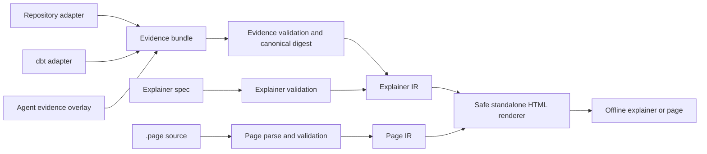

# PageScript v1.1 Design: Source-Cited System Explainers

## Decision

Evolve PageScript from a general-purpose compact web-language experiment into a deterministic compiler for source-cited architecture and data-lineage explainers.

The v1.1 product consists of two trustworthy authoring paths:

- `.page` files for compact, human- or agent-authored standalone pages.
- Evidence bundles plus explainer specifications for architecture and lineage reports.

The compiler owns validation, normalization, layout, and rendering. An analyzer or an agent may propose facts and presentation, but cannot inject executable browser code or bypass provenance checks.

## Product promise

Given a local repository, dbt artifacts, or a checked-in evidence bundle, PageScript produces one standalone HTML explainer that lets a reviewer:

- understand important components and relationships;
- search, filter, and select graph elements;
- see exactly which local source or artifact supports each claim; and
- reproduce the same output from the same inputs without network access.

The primary GitHub showcase will explain PageScript with PageScript, alongside a small reproducible dbt lineage fixture.

## Product boundary

PageScript is an evidence compiler, not a universal code-understanding service.

In scope for v1.1:

- secure, deterministic `.page` compilation;
- a versioned, source-cited evidence-bundle format;
- a separate explainer specification that curates a bundle into a narrative and views;
- deterministic local adapters for Rust, TypeScript/JavaScript, Python, and dbt artifacts;
- static, accessible, offline HTML explainers; and
- agent templates that create evidence overlays or explainer specifications under compiler validation.

Out of scope for v1.1:

- cloud hosting, accounts, collaboration, or background indexing;
- remote fetches during parsing, validation, compilation, or rendering;
- claims of full semantic understanding, type resolution, or call-graph accuracy for every language;
- arbitrary raw HTML, arbitrary CSS injection, source-authored JavaScript, or runtime plugins; and
- live production lineage connections.

The repository adapter extracts only structural facts that it can cite exactly. Agents may add inferred facts, but those facts must carry a rationale, confidence, and citations. The renderer presents extracted and inferred claims distinctly.

## Architecture



The explainer path deliberately has its own typed IR. The existing `PageIr` has graph and component support but cannot represent claim provenance without stringly attributes. The two render paths share a safe HTML writer, CSS, fixed declarative runtime, asset tests, and deterministic ordering.

Evidence workspace verification is separate from `.page` import resolution. A source citation can only resolve within the explicit evidence root; it never falls back to the process working directory or uses the page `Resolver` as an implicit file loader.

### Compiler API boundary

The public API will model validation as a state transition:

1. Parse input into an unvalidated document or bundle.
2. Validate it into a typed `ValidatedDocument`, `ValidatedEvidenceBundle`, or `ValidatedExplainerSpec`.
3. Compile only validated values into `PageIr` or `ExplainerIr`.
4. Render only normalized IR.

This prevents library callers from using parsing and rendering APIs in a way that bypasses the CLI's validation gate. Existing convenience functions remain as compatibility wrappers only if they validate internally.

## Evidence bundle

`*.evidence.json` is a canonical, versioned fact set. It contains source inventory, entities, relationships, and provenance; it does not contain renderer markup or executable behavior.

```json
{
  "schema_version": "1.0",
  "subject": {
    "kind": "repository",
    "name": "pagescript",
    "root": ".",
    "revision": "<git-sha>"
  },
  "sources": [
    {
      "id": "src:ir",
      "path": "rust/pagescript-rs/src/ir.rs",
      "digest": "sha256:<digest>"
    }
  ],
  "entities": [
    {
      "id": "module:ir",
      "kind": "module",
      "label": "IR compiler",
      "provenance": {
        "confidence": "extracted",
        "evidence": [{"source": "src:ir", "start_line": 1, "end_line": 20}]
      }
    }
  ],
  "relationships": []
}
```

### Required invariants

- Schema and bundle versions are explicit and rejected when unsupported.
- IDs are unique, stable, lower-case identifiers; every relationship endpoint exists.
- Paths are normalized, repository-relative POSIX paths with no traversal or absolute paths.
- Every source has a SHA-256 digest. A citation references one source and either a line range, a symbol, or a JSON pointer.
- Every extracted or inferred entity and relationship has at least one citation. Inferred claims also require a rationale. Declared presentation labels are explicitly marked and cannot masquerade as extracted facts.
- Maps, IDs, sources, entities, relationships, diagnostics, and layout tie-breaks are canonically ordered before hashing or serialization.
- A validated bundle exposes its canonical SHA-256 digest. Specifications pin that digest, preventing a report from silently describing a different fact set.
- Bundle validation never reads outside the approved root and never performs network access.

### Evidence overlay

An optional overlay lets a coding agent add source-cited inferred relationships or annotations to an adapter-generated bundle. Merge is deterministic and rejects duplicate IDs, endpoint changes, provenance removal, or an attempt to replace extracted facts. This gives agents room to add useful context without granting them authority to rewrite the evidence base.

## Explainer specification

`*.explainer.json` is the presentation layer. It references an evidence bundle by digest and contains titles, views, selections, grouping, callouts, and approved design tokens. It references entity and relationship IDs rather than restating source facts.

The compiler generates a default overview specification when one is not supplied. A custom specification can create an architecture view, lineage view, or focused subsystem view. All narrative callouts must reference entity or relationship IDs; the rendered citation drawer resolves those references back to the bundle.

This separation is intentional:

- adapters create auditable facts;
- agents and humans curate the story;
- the compiler verifies both before producing HTML.

## Adapters

### Repository adapter

`pagescript evidence repo <root> --out <bundle>` walks an approved local root, honors `.gitignore` plus `.pagescriptignore`, skips generated and oversized files with diagnostics, and emits only structural facts.

v1.1 supports Rust, TypeScript/JavaScript, and Python. For each supported language, the adapter extracts source files, modules, exported or top-level symbols where available, and explicit import/module relationships with exact locations. It also records workspace and package manifests. It does not claim type resolution, dynamic imports, reflection, or runtime call graphs.

Parser implementation must use maintained syntax parsers rather than regular-expression guesses. All unsupported or ambiguous constructs are surfaced as diagnostics or omitted; they are never fabricated as extracted facts.

### dbt adapter

`pagescript evidence dbt <manifest.json> --catalog <catalog.json> --project-root <root> --out <bundle>` creates models, sources, seeds, snapshots, tests, exposures, and dependency edges from dbt artifacts. It cites artifact JSON pointers and, when a local project root is available, the corresponding model file. Column descriptions become non-authoritative annotations rather than relationships.

The adapter supports common dbt manifest versions through explicit versioned readers. Unknown versions fail with a diagnostic that names the supported versions.

## CLI workflow

Existing `.page` commands remain available. New commands make each evidence stage visible and reviewable:

```sh
# Build facts, inspect them, then render a default explainer.
pagescript evidence repo ./my-service --out my-service.evidence.json
pagescript evidence validate my-service.evidence.json --root ./my-service
pagescript explain my-service.evidence.json --out architecture.html

# Add a curated, source-cited narrative generated by a coding agent.
pagescript evidence merge my-service.evidence.json agent.overlay.json --out enriched.evidence.json
pagescript explain enriched.evidence.json --spec architecture.explainer.json --out architecture.html

# Build a data-lineage explainer.
pagescript evidence dbt target/manifest.json \
  --catalog target/catalog.json --project-root . --out lineage.evidence.json
pagescript explain lineage.evidence.json --out lineage.html
```

`--json` produces stable diagnostics for automation. `--check` validates provenance digests against the local source root without writing output. All commands use explicit output paths and never create hidden, mutable project state.

## Explainer experience

The generated HTML is self-contained and has no runtime network requests. Each view includes:

- deterministic graph layout with stable coordinates;
- keyboard-accessible graph nodes and controls;
- text search, relationship-kind filters, and extracted/inferred confidence filters;
- a details panel with a human summary, relationships, and source citations;
- citation links only when a pinned safe `https` repository URL is present; otherwise a copyable `path:line` reference;
- a visible data-freshness/revision label; and
- a no-JavaScript fallback listing entities, relationships, and citations.

Default rendering limits a view to 500 entities and 1,000 relationships. Larger bundles must provide focused views or grouping; the compiler reports a diagnostic rather than shipping an unusable SVG.

## Secure deterministic compiler rescue

Before evidence work lands, the `.page` pipeline must meet its existing contract.

- Replace serialized `HashMap` values with ordered maps and add canonical serialization tests.
- Reject case-insensitive `</style` in scoped CSS; preserve a renderer-side guard as defense in depth.
- Apply a tag- and attribute-aware URL policy. Relative URLs, fragments, and explicitly allowlisted `https`, `http`, `mailto`, and `tel` URLs are allowed only in appropriate contexts. `javascript:`, `vbscript:`, control characters, and unapproved `data:` URLs are rejected.
- Centralize component, attribute, value-type, URI, parent/child, and Web Core allowlist rules in one schema module shared by validators and IR lowering.
- Validate imported documents recursively, resolve each import relative to its importer inside a canonical project root, surface all parse/resolution errors, and reject import cycles and symlink escapes.
- Detect recipe expansion cycles and enforce a deterministic depth and node budget.
- Align renderer markup, CSS, and runtime behavior. Unsupported `log`, `count-up`, `bind`, `on`, and `reveal` semantics must either be fully implemented with tests or rejected as unavailable; v1.1 keeps only features needed by the explainer runtime.

## Compatibility and release

The language moves to Draft 0.7 while the crate moves to v1.1.0. Ordinary valid `.page` sources remain supported. Inputs that were previously accepted only because validation was incomplete may become errors; the migration guide classifies these as security or correctness fixes.

The public GitHub release is the primary distribution target. crates.io publishing remains enabled only when a registry token is deliberately configured; documentation and release automation must describe that truthfully. Release automation must choose one authoritative release path rather than presenting a disabled `release-plz` publish configuration as active publishing.

## Completion criteria

v1.1 is complete when all of the following are true:

1. Every known security, recursion, import, type-loss, and nondeterminism probe is a passing regression test.
2. Fifty fresh compiler processes produce byte-identical AST, IR, diagnostics, evidence-bundle, explainer-IR, and HTML outputs for fixed fixtures.
3. All shipped `.page`, evidence, and explainer fixtures validate against public JSON schemas and conformance expectations.
4. Repository and dbt adapters generate deterministic, source-cited bundles for their checked-in fixtures.
5. The flagship self-analysis and dbt lineage explainers pass browser, accessibility, visual, offline-network, and keyboard-navigation tests.
6. README, specifications, security policy, templates, Pages site, package metadata, and release workflows describe only supported behavior.
7. A clean clone can run the documented install, validation, adapter, render, and release-smoke workflows successfully.
